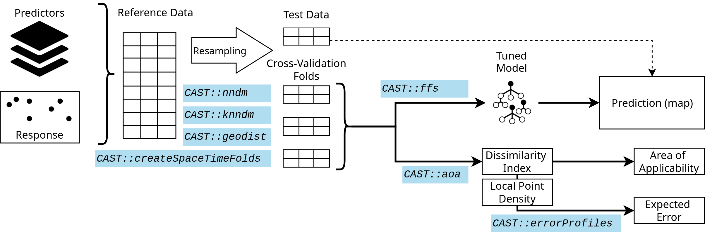

# CAST: Caret Applications for Spatio-Temporal models  

<!-- Start Badges -->

<!-- End Badges -->

Supporting functionality to run 'caret' with spatial or spatial-temporal data. 'caret' is a frequently used package for model training and prediction using machine learning. CAST includes functions to improve spatial or spatial-temporal modelling tasks using 'caret'. To decrease spatial overfitting and to improve model performances, the package implements a forward feature selection that selects suitable predictor variables in view to their contribution to spatial or spatio-temporal model performance. CAST further includes functionality to estimate the (spatial) area of applicability of prediction models.

Note: The developer version of CAST can be found on https://github.com/HannaMeyer/CAST. 
The CRAN Version can be found on	https://CRAN.R-project.org/package=CAST

*The figure shows a very simple workflow for a spatial prediction mapping workflow, indicating which function in CAST can be used in the different steps to support the spatial prediction.*

## Package Website
https://hannameyer.github.io/CAST/

## Tutorials

* [The CAST package for training and assessment of spatial prediction models in R](https://arxiv.org/abs/2404.06978)

* [Introduction to CAST](https://hannameyer.github.io/CAST/articles/cast01-CAST-intro.html)

* [Visualization of nearest neighbor distance distributions](https://hannameyer.github.io/CAST/articles/cast02-plotgeodist.html)

* [Nearest neighbor distance matching Cross-validation in CAST](https://hannameyer.github.io/CAST/articles/cast03-CV.html)

* [Area of applicability of spatial prediction models](https://hannameyer.github.io/CAST/articles/cast04-AOA-tutorial.html)

* [Improve computation time of CAST methods](https://hannameyer.github.io/CAST/articles/cast05-parallel.html)

* The talk from the OpenGeoHub summer school 2019 on spatial validation and variable selection:
https://www.youtube.com/watch?v=mkHlmYEzsVQ.

* Tutorial (https://youtu.be/EyP04zLe9qo) and Lecture (https://youtu.be/OoNH6Nl-X2s) recording from OpenGeoHub summer school 2020 on the area of applicability. As well as talk at the OpenGeoHub summer school 2021: https://av.tib.eu/media/54879 

* Talk and tutorial from the OpenGeoHub 2022 summer school on Machine learning-based maps of the environment - challenges of extrapolation and overfitting, including discussions on the area of applicability and the nearest neighbor distance matching cross-validation (https://doi.org/10.5446/59412).

## Scientific documentation of the methods

* Meyer, H., Ludwig, L., Milà, C., Linnenbrink, J., Schumacher, F. (2024): The CAST package for training and assessment of spatial prediction models in R. arXiv, https://doi.org/10.48550/arXiv.2404.06978.

### Spatial cross-validation
* Milà, C., Mateu, J., Pebesma, E., Meyer, H. (2022): Nearest Neighbour Distance Matching Leave-One-Out Cross-Validation for map validation. Methods in Ecology and Evolution 00, 1– 13.
https://doi.org/10.1111/2041-210X.13851

* Linnenbrink, J., Milà, C., Ludwig, M., and Meyer, H.: kNNDM (2023): k-fold Nearest Neighbour Distance Matching Cross-Validation for map accuracy estimation. EGUsphere [preprint]. 
https://doi.org/10.5194/egusphere-2023-1308

* Meyer, H., Reudenbach, C., Hengl, T., Katurji, M., Nauss, T. (2018): Improving performance of spatio-temporal machine learning models using forward feature selection and target-oriented validation. Environmental Modelling & Software, 101, 1-9. https://doi.org/10.1016/j.envsoft.2017.12.001

### Spatial variable selection
* Meyer, H., Reudenbach, C., Hengl, T., Katurji, M., Nauss, T. (2018): Improving performance of spatio-temporal machine learning models using forward feature selection and target-oriented validation. Environmental Modelling & Software, 101, 1-9. https://doi.org/10.1016/j.envsoft.2017.12.001

* Meyer, H., Reudenbach, C., Wöllauer, S., Nauss, T. (2019): Importance of spatial predictor variable selection in machine learning applications - Moving from data reproduction to spatial prediction. Ecological Modelling. 411. https://doi.org/10.1016/j.ecolmodel.2019.108815

### Area of applicability
* Meyer, H., Pebesma, E. (2021). Predicting into unknown space? Estimating the area of applicability of spatial prediction models. Methods in Ecology and Evolution, 12, 1620– 1633. https://doi.org/10.1111/2041-210X.13650 

### Applications and use cases
* Meyer, H., Pebesma, E. (2022): Machine learning-based global maps of ecological variables and the challenge of assessing them. Nature Communications, 13. https://www.nature.com/articles/s41467-022-29838-9

* Ludwig, M., Moreno-Martinez, A., Hoelzel, N., Pebesma, E., Meyer, H. (2023): Assessing and improving the transferability of current global spatial prediction models. Global Ecology and Biogeography.  https://doi.org/10.1111/geb.13635.

* Milà, C., Ludwig, M., Pebesma, E., Tonne, C., and Meyer, H.: Random forests with spatial proxies for environmental modelling: opportunities and pitfalls, EGUsphere [preprint]. https://doi.org/10.5194/egusphere-2024-138, 2024. 
