# 4. Area of applicability of spatial prediction models

------------------------------------------------------------------------

## Introduction

In spatial predictive mapping, models are often applied to make
predictions far beyond sampling locations (i.e. field observations used
to map a variable even on a global scale), where new locations might
considerably differ in their environmental properties. However, areas in
the predictor space without support of training data are problematic.
The model has not been enabled to learn about relationships in these
environments and predictions for such areas have to be considered highly
uncertain.

In CAST, we implement the methodology described in [Meyer&Pebesma
(2021)](https://doi.org/10.1111/2041-210X.13650) to estimate the “area
of applicability” (AOA) of (spatial) prediction models. The AOA is
defined as the area where we enabled the model to learn about
relationships based on the training data, and where the estimated
cross-validation performance holds. To delineate the AOA, first an
dissimilarity index (DI) is calculated that is based on distances to the
training data in the multidimensional predictor variable space. To
account for relevance of predictor variables responsible for prediction
patterns we weight variables by the model-derived importance scores
prior to distance calculation. The AOA is then derived by applying a
threshold based on the DI observed in the training data using
cross-validation.

This tutorial shows an example of how to estimate the area of
applicability of spatial prediction models.

For further information see: Meyer, H., & Pebesma, E. (2021). Predicting
into unknown space? Estimating the area of applicability of spatial
prediction models. Methods in Ecology and Evolution, 12, 1620– 1633.
\[<https://doi.org/10.1111/2041-210X.13650>\]

#### Getting started

``` r
library(CAST)
library(caret)
library(terra)
library(sf)
library(viridis)
library(gridExtra)
```

## Example 1: Using simulated data

### Get data

#### Generate Predictors

As predictor variables, a set of bioclimatic variables are used
(<https://www.worldclim.org>). For this tutorial, they have been
originally downloaded using the getData function from the raster package
but cropped to an area in central Europe. The cropped data are provided
in the CAST package.

``` r
predictors <- rast(system.file("extdata","bioclim.tif",package="CAST"))
plot(predictors,col=viridis(100))
```


#### Generate Response

To be able to test the reliability of the method, we’re using a
simulated prediction task. We therefore simulate a virtual response
variable from the bioclimatic variables.

``` r
generate_random_response <- function(raster, predictornames =
names(raster), seed = sample(seq(1000), 1)){
  operands_1 = c("+", "-", "*", "/")
  operands_2 = c("^1","^2")
  
  expression <- paste(as.character(predictornames, sep=""))
  # assign random power to predictors
  set.seed(seed)
  expression <- paste(expression,
                      sample(operands_2, length(predictornames),
replace = TRUE),
                      sep = "")
  
  # assign random math function between predictors (expect after the last one)
  set.seed(seed)
  expression[-length(expression)] <- paste(expression[-
length(expression)],
                                           sample(operands_1,
length(predictornames)-1, replace = TRUE),
                                           sep = " ")
  print(paste0(expression, collapse = " "))
  # collapse
  e = paste0("raster$", expression, collapse = " ")
  
  response = eval(parse(text = e))
  names(response) <- "response"
  return(response)
  
}
```

``` r
response <- generate_random_response (predictors, seed = 10)
```

    ## [1] "bio2^1 * bio5^1 + bio10^2 - bio13^2 / bio14^2 / bio19^1"

``` r
plot(response,col=viridis(100),main="virtual response")
```


#### Simulate sampling locations

To simulate a typical prediction task, field sampling locations are
randomly selected. Here, we randomly select 20 points. Note that this is
a very small data set, but used here to avoid long computation times.

``` r
mask <- predictors[[1]]
values(mask)[!is.na(values(mask))] <- 1
mask <- st_as_sf(as.polygons(mask))
mask <- st_make_valid(mask)
```

``` r
set.seed(15)
samplepoints <- st_as_sf(st_sample(mask,20,"random"))

plot(response,col=viridis(100))
plot(samplepoints,col="red",add=T,pch=3)
```

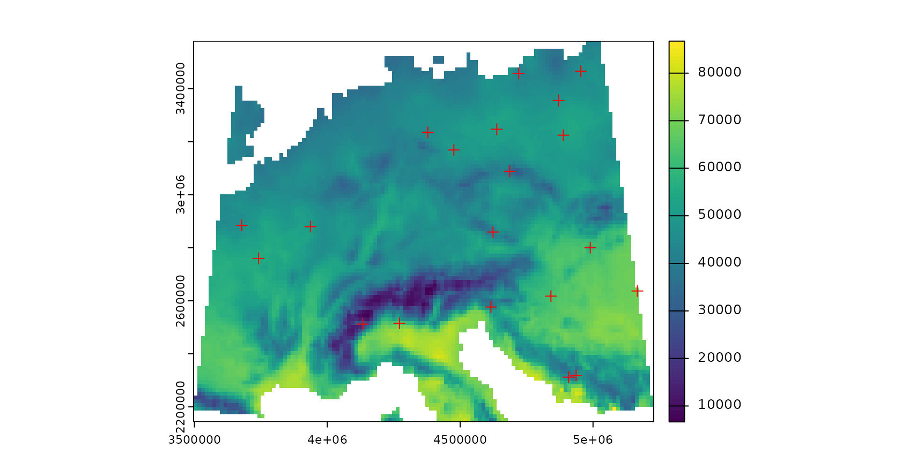

### Model training

Next, a machine learning algorithm will be applied to learn the
relationships between predictors and response.

#### Prepare data

Therefore, predictors and response are extracted for the sampling
locations.

``` r
trainDat <- extract(predictors,samplepoints,na.rm=FALSE)
trainDat$response <- extract(response,samplepoints,na.rm=FALSE, ID=FALSE)$response
trainDat <- na.omit(trainDat)
```

#### Train the model

Random Forest is applied here as machine learning algorithm (others can
be used as well, as long as variable importance is returned). The model
is validated by default cross-validation to estimate the prediction
error.

``` r
set.seed(10)
model <- train(trainDat[,names(predictors)],
               trainDat$response,
               method="rf",
               importance=TRUE,
               trControl = trainControl(method="cv"))
print(model)
```

    ## Random Forest 
    ## 
    ## 20 samples
    ##  6 predictor
    ## 
    ## No pre-processing
    ## Resampling: Cross-Validated (10 fold) 
    ## Summary of sample sizes: 18, 18, 18, 18, 18, 18, ... 
    ## Resampling results across tuning parameters:
    ## 
    ##   mtry  RMSE      Rsquared  MAE     
    ##   2     3854.481  1         3310.203
    ##   4     3084.764  1         2675.126
    ##   6     2960.314  1         2571.475
    ## 
    ## RMSE was used to select the optimal model using the smallest value.
    ## The final value used for the model was mtry = 6.

#### Variable importance

The estimation of the AOA will require the importance of the individual
predictor variables.

``` r
plot(varImp(model,scale = F),col="black")
```


#### Predict and calculate error

The trained model is then used to make predictions for the entire area
of interest. Since a simulated area-wide response is used, it’s possible
in this tutorial to compare the predictions with the true reference.

``` r
prediction <- predict(predictors,model,na.rm=T)
truediff <- abs(prediction-response)
plot(rast(list(prediction,response)),main=c("prediction","reference"))
```

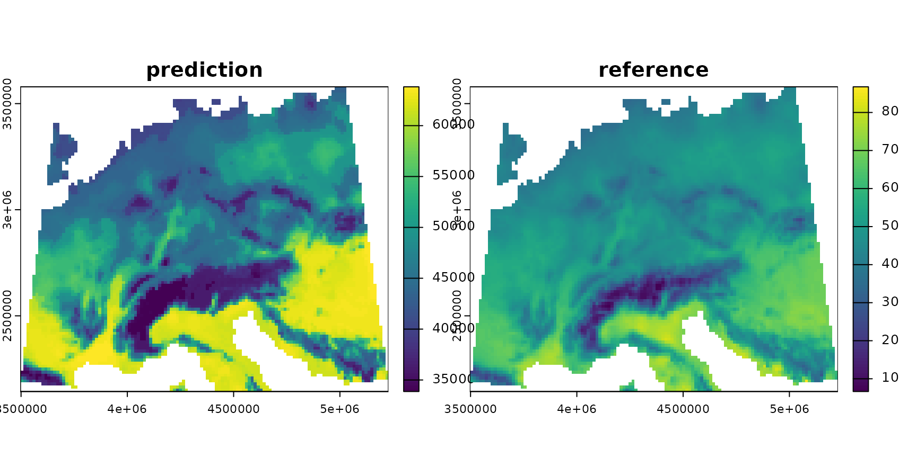

### AOA and LPD calculation

The visualization above shows the predictions made by the model. In the
next step, the DI, LPD and AOA will be calculated. Note that it is
possible to calculate the AOA without calculating the LPD, which can be
very time consuming (arg: `LPD = FALSE`).

The AOA calculation takes the model as input to extract the importance
of the predictors, used as weights in multidimensional distance
calculation. Note that the AOA can also be calculated without a trained
model (i.e. using training data and new data only). In this case all
predictor variables are treated equally important (unless weights are
given in form of a table).

``` r
AOA <- aoa(predictors, model, LPD = TRUE, verbose = FALSE)
class(AOA)
```

    ## [1] "aoa"

``` r
names(AOA)
```

    ## [1] "parameters" "DI"         "AOA"        "LPD"

``` r
print(AOA)
```

    ## DI:
    ## class       : SpatRaster 
    ## size        : 102, 123, 1  (nrow, ncol, nlyr)
    ## resolution  : 14075.98, 14075.98  (x, y)
    ## extent      : 3496791, 5228136, 2143336, 3579086  (xmin, xmax, ymin, ymax)
    ## coord. ref. : +proj=laea +lat_0=52 +lon_0=10 +x_0=4321000 +y_0=3210000 +ellps=GRS80 +units=m +no_defs 
    ## source(s)   : memory
    ## varname     : bioclim 
    ## name        :       DI 
    ## min value   : 0.000000 
    ## max value   : 3.408739 
    ## LPD:
    ## class       : SpatRaster 
    ## size        : 102, 123, 1  (nrow, ncol, nlyr)
    ## resolution  : 14075.98, 14075.98  (x, y)
    ## extent      : 3496791, 5228136, 2143336, 3579086  (xmin, xmax, ymin, ymax)
    ## coord. ref. : +proj=laea +lat_0=52 +lon_0=10 +x_0=4321000 +y_0=3210000 +ellps=GRS80 +units=m +no_defs 
    ## source(s)   : memory
    ## varname     : bioclim 
    ## name        : LPD 
    ## min value   :   0 
    ## max value   :   9 
    ## AOA:
    ## class       : SpatRaster 
    ## size        : 102, 123, 1  (nrow, ncol, nlyr)
    ## resolution  : 14075.98, 14075.98  (x, y)
    ## extent      : 3496791, 5228136, 2143336, 3579086  (xmin, xmax, ymin, ymax)
    ## coord. ref. : +proj=laea +lat_0=52 +lon_0=10 +x_0=4321000 +y_0=3210000 +ellps=GRS80 +units=m +no_defs 
    ## source(s)   : memory
    ## varname     : bioclim 
    ## name        : AOA 
    ## min value   :   0 
    ## max value   :   1 
    ## 
    ## 
    ## Predictor Weights:
    ##       bio2     bio5    bio10   bio13 bio14 bio19
    ## 1 3.746582 17.92456 17.04888 2.15925     0     0
    ## 
    ## 
    ## AOA Threshold: 0.3221291

Plotting the `aoa` object shows the distribution of DI values within the
training data and the DI of the new data.

``` r
plot(AOA)
```

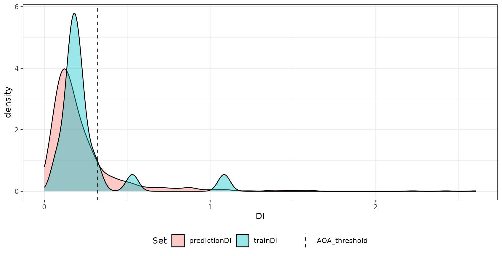 The
most important output of the `aoa` function are three raster data sets:
The first is the DI that is the normalized and weighted minimum distance
to a nearest training data point divided by the average distance within
the training data. The second is the AOA which is derived from the DI by
using a threshold. The threshold is the (outlier-removed) maximum DI
observed in the training data where the DI of the training data is
calculated by considering the cross-validation folds. The last is the
LPD that is an absolute count of training data points, that are within
the AOA threshold for a new prediction location. An LPD of `0` therefore
signifies a prediction location outside the AOA and `>1` inside the AOA.
The specific LPD values give a good indication about the coverage by
similar training data for a new prediction location. The used threshold
and all relevant information about the DI and LPD of the training data
is returned in the `parameters` list entry.

We can plot the DI and LPD as well as predictions within the AOA:

``` r
plot(truediff,col=viridis(100),main="true prediction error")
plot(AOA$DI,col=viridis(100),main="DI")
plot(AOA$LPD,col=viridis(100),main="LPD")
#mask prediction with AOA:
plot(mask(prediction,AOA$AOA,maskvalue=0),
     col=viridis(100),main="Prediction for AOA")
```

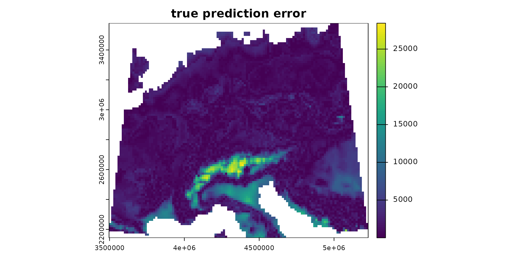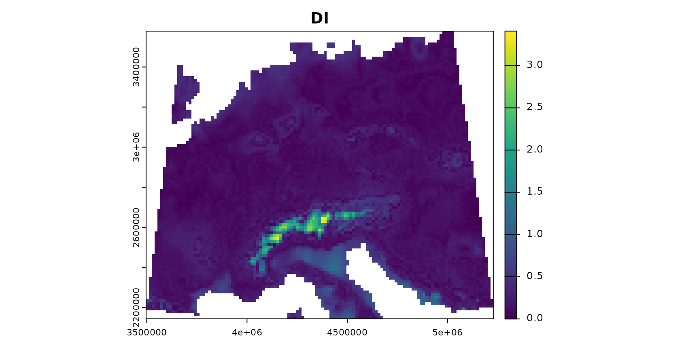

The patterns in the DI and LPD are in general agreement with the true
prediction error. Very high DI values are present in the Alps, as they
have not been covered by training data but feature very distinct
environmental conditions. Since the DI values for these areas are above
the threshold, we regard this area as outside the AOA.

### AOA for spatially clustered data?

The example above had randomly distributed training samples. However,
sampling locations might also be highly clustered in space. In this
case, the random cross-validation is not meaningful (see e.g. [Meyer et
al. 2018](https://doi.org/10.1016/j.envsoft.2017.12.001), [Meyer et
al. 2019](https://doi.org/10.1016/j.ecolmodel.2019.108815), [Valavi et
al. 2019](https://doi.org/10.1111/2041-210X.13107), [Roberts et
al. 2018](https://doi.org/10.1111/ecog.02881), [Pohjankukka et
al. 2017](https://doi.org/10.1080/13658816.2017.1346255), [Brenning
2012](https://CRAN.R-project.org/package=sperrorest))

A random cross-validation in this case would lead to a apparently high
prediction performance, but this would only apply to a very small AOA,
because the threshold on the DI is based in distance to a nearest data
point within the training data (which is usually very small when data
are clustered). To assess the model performance for larger areas,
cross-validation should be based on a spatial CV, e.g. a
leave-cluster-out approach (see vignette on spatial CV in this package
for a more detailed discussion on cross validation strategies), where
also the AOA estimation is based on distances to a nearest data point
not located in the same spatial cluster.

To show how this looks like, we use 15 spatial locations and simulate 5
data points around each location.

``` r
set.seed(25)
samplepoints <- clustered_sample(mask,75,15,radius=25000)

plot(response,col=viridis(100))
plot(samplepoints,col="red",add=T,pch=3)
```

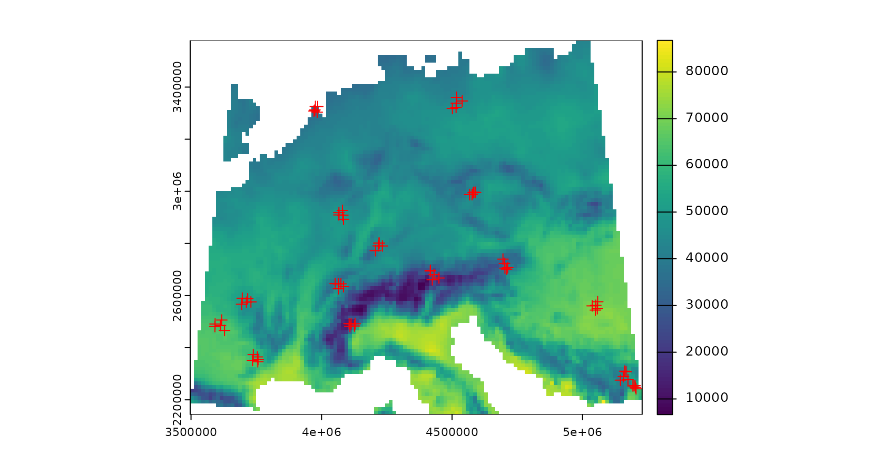

``` r
trainDat <- extract(predictors,samplepoints,na.rm=FALSE)
trainDat$response <- extract(response,samplepoints,na.rm=FALSE)$response
trainDat <- data.frame(trainDat,samplepoints)
trainDat <- na.omit(trainDat)
```

We first train a model with (in this case) inappropriate random
cross-validation.

``` r
set.seed(10)
model_random <- train(trainDat[,names(predictors)],
               trainDat$response,
               method="rf",
               importance=TRUE,
               trControl = trainControl(method="cv"))
prediction_random <- predict(predictors,model_random,na.rm=TRUE)
print(model_random)
```

    ## Random Forest 
    ## 
    ## 75 samples
    ##  6 predictor
    ## 
    ## No pre-processing
    ## Resampling: Cross-Validated (10 fold) 
    ## Summary of sample sizes: 68, 67, 68, 68, 68, 67, ... 
    ## Resampling results across tuning parameters:
    ## 
    ##   mtry  RMSE       Rsquared   MAE     
    ##   2     1088.1729  0.9956237  790.2191
    ##   4      921.1760  0.9968527  717.5578
    ##   6      922.1137  0.9967308  715.7016
    ## 
    ## RMSE was used to select the optimal model using the smallest value.
    ## The final value used for the model was mtry = 4.

…and a model based on leave-cluster-out cross-validation.

``` r
folds <- CreateSpacetimeFolds(trainDat, spacevar="parent",k=10)
set.seed(15)
model <- train(trainDat[,names(predictors)],
                 trainDat$response,
                     method="rf",
                 importance=TRUE,
                 tuneGrid = expand.grid(mtry = c(2:length(names(predictors)))),
                 trControl = trainControl(method="cv",index=folds$index))
  print(model)
```

    ## Random Forest 
    ## 
    ## 75 samples
    ##  6 predictor
    ## 
    ## No pre-processing
    ## Resampling: Cross-Validated (10 fold) 
    ## Summary of sample sizes: 70, 70, 65, 70, 70, 65, ... 
    ## Resampling results across tuning parameters:
    ## 
    ##   mtry  RMSE      Rsquared   MAE     
    ##   2     3227.421  0.9382904  2740.529
    ##   3     2761.092  0.9433621  2396.941
    ##   4     2677.002  0.9570317  2349.310
    ##   5     2587.598  0.9486190  2282.064
    ##   6     2494.756  0.9425158  2190.718
    ## 
    ## RMSE was used to select the optimal model using the smallest value.
    ## The final value used for the model was mtry = 6.

``` r
prediction <- predict(predictors,model,na.rm=TRUE)
```

The AOA is then calculated (for comparison) using the model validated by
random cross-validation, and second by taking the spatial clusters into
account and calculating the threshold based on minimum distances to a
nearest training point not located in the same cluster. This is done in
the aoa function, where the folds used for cross-validation are
automatically extracted from the model.

``` r
AOA_spatial <- aoa(predictors, model, LPD = TRUE, verbose = FALSE)

AOA_random <- aoa(predictors, model_random, LPD = FALSE, verbose = FALSE)
```

``` r
plot(AOA_spatial$DI,col=viridis(100),main="DI")
plot(AOA_spatial$LPD,col=viridis(100),main="LPD")
#mask prediction with AOA:
plot(mask(prediction,AOA_spatial$AOA,maskvalue=0), col=viridis(100),main="prediction for AOA (spatial CV error applies)",
     cex.main=0.75)
plot(mask(prediction_random,AOA_random$AOA,maskvalue=0), col=viridis(100),main="prediction for AOA (random CV error applies)", cex.main=0.75)
```

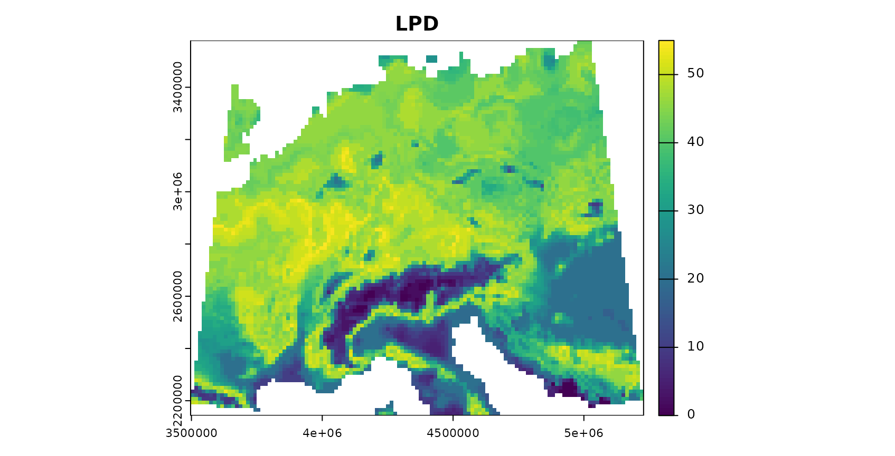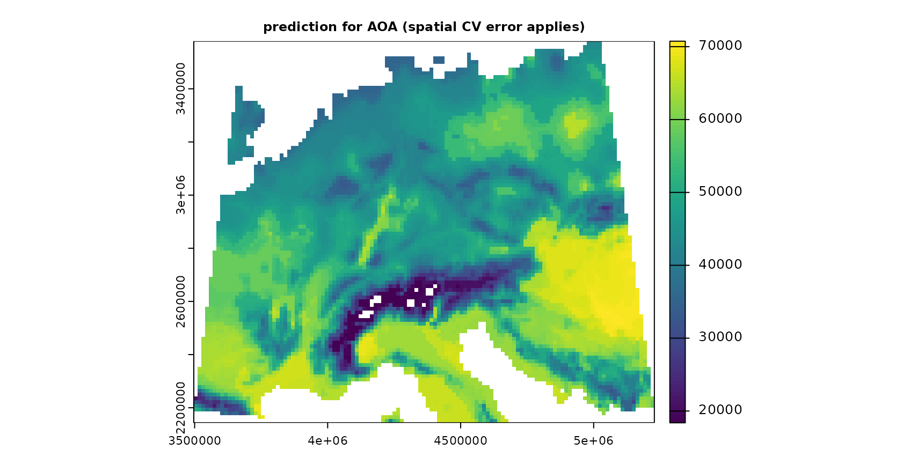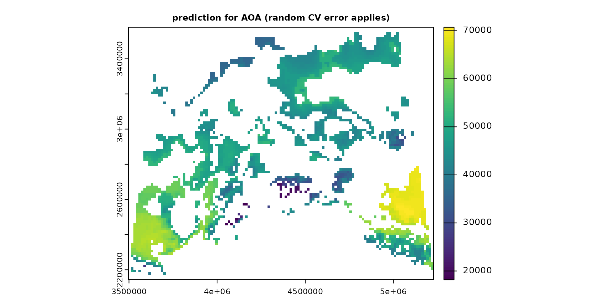

Note that the AOA is much larger for the spatial CV approach. However,
the spatial cross-validation error is considerably larger, hence also
the area for which this error applies is larger. The random
cross-validation performance is very high, however, the area to which
the performance applies is small. This fact is also apparent if you plot
the `aoa` objects which will display the distributions of the DI of the
training data as well as the DI of the new data. For random CV most of
the predictionDI is larger than the AOA threshold determined by the
trainDI. Using spatial CV, the predictionDI is well within the DI of the
training sample.

``` r
grid.arrange(plot(AOA_spatial, variable = "DI") + ggplot2::ggtitle("Spatial CV"),
             plot(AOA_random, variable = "DI") + ggplot2::ggtitle("Random CV"), ncol = 2)
```

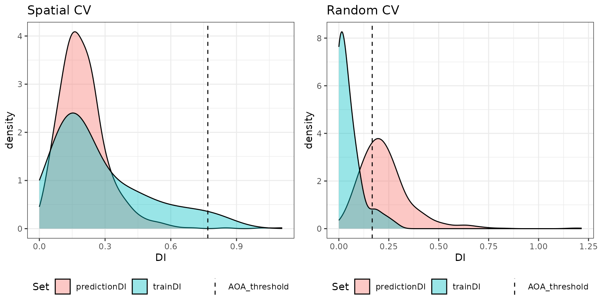

### Comparison prediction error with model error

Since we used a simulated response variable, we can now compare the
prediction error within the AOA with the model error, assuming that the
model error applies inside the AOA but not outside.

``` r
###for the spatial CV:
RMSE(values(prediction)[values(AOA_spatial$AOA)==1],
     values(response)[values(AOA_spatial$AOA)==1])
```

    ## [1] 3308.808

``` r
RMSE(values(prediction)[values(AOA_spatial$AOA)==0],
     values(response)[values(AOA_spatial$AOA)==0])
```

    ## [1] 10855.31

``` r
model$results
```

    ##   mtry     RMSE  Rsquared      MAE   RMSESD RsquaredSD    MAESD
    ## 1    2 3227.421 0.9382904 2740.529 2335.609 0.06774290 2168.398
    ## 2    3 2761.092 0.9433621 2396.941 1823.280 0.07190124 1674.310
    ## 3    4 2677.002 0.9570317 2349.310 1690.078 0.04208035 1549.323
    ## 4    5 2587.598 0.9486190 2282.064 1595.276 0.05220790 1410.225
    ## 5    6 2494.756 0.9425158 2190.718 1507.700 0.07431001 1289.825

``` r
###and for the random CV:
RMSE(values(prediction_random)[values(AOA_random$AOA)==1],
     values(response)[values(AOA_random$AOA)==1])
```

    ## [1] 1365.329

``` r
RMSE(values(prediction_random)[values(AOA_random$AOA)==0],
     values(response)[values(AOA_random$AOA)==0])
```

    ## [1] 3959.685

``` r
model_random$results
```

    ##   mtry      RMSE  Rsquared      MAE   RMSESD  RsquaredSD    MAESD
    ## 1    2 1088.1729 0.9956237 790.2191 595.2632 0.004567068 407.8754
    ## 2    4  921.1760 0.9968527 717.5578 437.1580 0.002792369 311.1915
    ## 3    6  922.1137 0.9967308 715.7016 412.0427 0.002498990 306.1030

The results indicate that there is a high agreement between the model CV
error (RMSE) and the true prediction RMSE. This is the case for both,
the random as well as the spatial model.

### Relationship between the DI/LPD and the performance measure

The relationship between error and DI or LPD can be used to limit
predictions to an area (within the AOA) where a required performance
(e.g. RMSE, R2, Kappa, Accuracy) applies. This can be done using the
result of errorProfiles which used the relationship analyzed in a window
of DI/LPD values. The corresponding model (here: shape constrained
additive models which is the default: Monotone increasing P-splines with
the dimension of the basis used to represent the smooth term is 6 and a
2nd order penalty.) can be used to estimate the performance on a pixel
level, which then allows limiting predictions using a threshold. Note
that we used a multi-purpose CV to estimate the relationship between the
DI and the RMSE here (see details in the paper).

``` r
DI_RMSE_relation <- errorProfiles(model, AOA_spatial$parameters, multiCV=TRUE,
                                    window.size = 5, length.out = 5, variable = "DI")
plot(DI_RMSE_relation)
```


``` r
LPD_RMSE_relation <- errorProfiles(model, AOA_spatial$parameters, multiCV=TRUE,
                                    window.size = 5, length.out = 5, variable = "LPD")
plot(LPD_RMSE_relation)
```

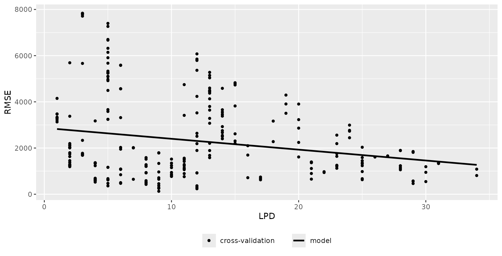

``` r
DI_expected_RMSE = terra::predict(AOA_spatial$DI, DI_RMSE_relation)
LPD_expected_RMSE = terra::predict(AOA_spatial$LPD, LPD_RMSE_relation)

# account for multiCV changing the DI threshold
DI_updated_AOA = AOA_spatial$DI > attr(DI_RMSE_relation, "AOA_threshold")

# account for multiCV changing the DI threshold
LPD_updated_AOA = AOA_spatial$DI > attr(LPD_RMSE_relation, "AOA_threshold")

#mask prediction with AOA:
plot(mask(DI_expected_RMSE,DI_updated_AOA,maskvalue=0),col=viridis(100),main="DI expected RMSE")
```

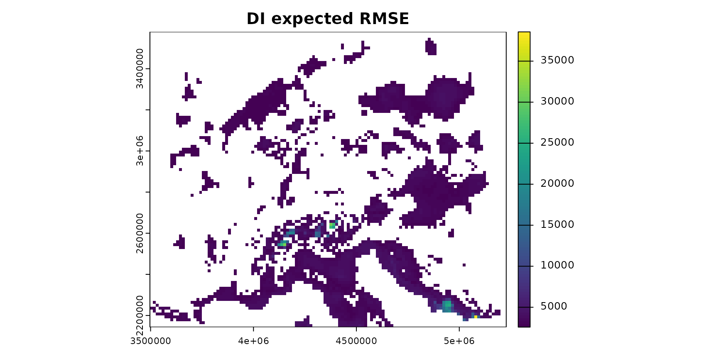

``` r
plot(mask(LPD_expected_RMSE,LPD_updated_AOA,maskvalue=0),col=viridis(100),main="LPD expected RMSE")
```

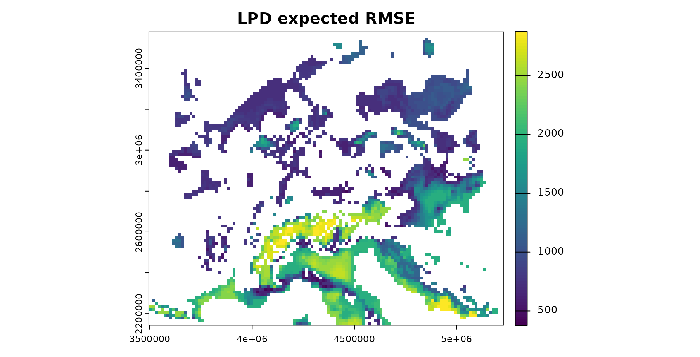

## Example 2: A real-world example

The example above used simulated data so that it allows to analyze the
reliability of the AOA. However, a simulated area-wide response is not
available in usual prediction tasks. Therefore, as a second example the
AOA is estimated for a dataset that has point observations as a
reference only.

### Data and preprocessing

To do so, we will work with the cookfarm dataset, described in
e.g. [Gasch et al 2015](https://doi.org/10.1016/j.spasta.2015.04.001).
The dataset included in CAST is a re-structured dataset. Find more
details also in the vignette “Introduction to CAST”. We will use soil
moisture (VW) as response variable here. Hence, we’re aiming at making a
spatial continuous prediction based on limited measurements from data
loggers.

``` r
data(cookfarm)
# calculate average of VW for each sampling site:
dat <- aggregate(cookfarm[,c("VW","Easting","Northing")],by=list(as.character(cookfarm$SOURCEID)),mean)
# create sf object from the data:
pts <- st_as_sf(dat,coords=c("Easting","Northing"))

##### Extract Predictors for the locations of the sampling points
studyArea <- rast(system.file("extdata","predictors_2012-03-25.tif",package="CAST"))
st_crs(pts) <- crs(studyArea)
trainDat <- extract(studyArea,pts,na.rm=FALSE)
pts$ID <- 1:nrow(pts)
trainDat <- merge(trainDat,pts,by.x="ID",by.y="ID")
# The final training dataset with potential predictors and VW:
head(trainDat)
```

    ##   ID      DEM      TWI  BLD       NDRE.M   NDRE.Sd     Bt Easting Northing
    ## 1  1 788.1906 4.304258 1.42 -0.051189531 0.2506899 0.0000  493384  5180587
    ## 2  2 788.3813 3.863605 1.29 -0.046459336 0.1754623 0.0000  493514  5180567
    ## 3  3 790.5244 3.947488 1.36 -0.040845532 0.2225785 0.0000  493574  5180577
    ## 4  4 775.7229 5.395786 1.55 -0.004329725 0.2099845 0.0501  493244  5180587
    ## 5  5 796.7618 3.534822 1.31  0.027252737 0.2002646 0.0000  493624  5180607
    ## 6  6 795.8370 3.815516 1.40 -0.123434804 0.2180606 0.0000  493694  5180607
    ##   MinT_wrcc MaxT_wrcc Precip_cum  cday Precip_wrcc Group.1        VW
    ## 1       1.1      36.2       10.6 15425           0  CAF003 0.2894505
    ## 2       1.1      36.2       10.6 15425           0  CAF007 0.2705531
    ## 3       1.1      36.2       10.6 15425           0  CAF009 0.2629683
    ## 4       1.1      36.2       10.6 15425           0  CAF019 0.2993580
    ## 5       1.1      36.2       10.6 15425           0  CAF031 0.2664754
    ## 6       1.1      36.2       10.6 15425           0  CAF033 0.2650177
    ##                   geometry
    ## 1 POINT (493383.1 5180586)
    ## 2 POINT (493510.7 5180568)
    ## 3 POINT (493574.6 5180573)
    ## 4 POINT (493246.6 5180590)
    ## 5 POINT (493628.3 5180612)
    ## 6 POINT (493692.2 5180610)

### Model training and prediction

A set of variables is used as predictors for VW in a random Forest
model. The model is validated with a leave one out cross-validation.
Note that the model performance is very low, due to the small dataset
being used here (and for this small dataset a low ability of the
predictors to model VW).

``` r
predictors <- c("DEM","NDRE.Sd","TWI","Bt")
response <- "VW"

model <- train(trainDat[,predictors],trainDat[,response],
               method="rf",tuneLength=3,importance=TRUE,
               trControl=trainControl(method="LOOCV"))
model
```

    ## Random Forest 
    ## 
    ## 42 samples
    ##  4 predictor
    ## 
    ## No pre-processing
    ## Resampling: Leave-One-Out Cross-Validation 
    ## Summary of sample sizes: 41, 41, 41, 41, 41, 41, ... 
    ## Resampling results across tuning parameters:
    ## 
    ##   mtry  RMSE        Rsquared    MAE       
    ##   2     0.04043599  0.02194320  0.03272203
    ##   3     0.04130865  0.01657314  0.03310715
    ##   4     0.04090019  0.02358726  0.03295413
    ## 
    ## RMSE was used to select the optimal model using the smallest value.
    ## The final value used for the model was mtry = 2.

#### Prediction

Next, the model is used to make predictions for the entire study area.

``` r
#Predictors:
plot(stretch(studyArea[[predictors]]))
```


``` r
#prediction:
prediction <- predict(studyArea,model,na.rm=TRUE)
```

### AOA estimation

Next we’re limiting the predictions to the AOA. Predictions outside the
AOA should be excluded.

``` r
AOA <- aoa(studyArea, model, LPD = TRUE, verbose = FALSE)

#### Plot results:
plot(AOA$DI,col=viridis(100),main="DI with sampling locations (red)")
plot(pts,zcol="ID",col="red",add=TRUE)

plot(AOA$LPD,col=viridis(100),main="LPD with sampling locations (red)")
plot(pts,zcol="ID",col="red",add=TRUE)

#show only predictions inside the AOA (mask):
plot(mask(prediction,AOA$AOA,maskvalue=0), col=viridis(100), main="prediction for AOA (LOOCV error applies)", cex.main=0.75)
```

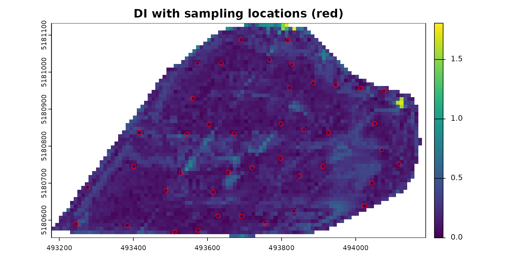

## Final notes

- The AOA is estimated based on training data and new data (i.e. raster
  group of the entire area of interest). The trained model are only used
  for getting the variable importance needed to weight predictor
  variables. These can be given as a table either, so the approach can
  be used with other packages than caret as well.
- Knowledge on the AOA is important when predictions are used as a
  baseline for decision making or subsequent environmental modelling.
- We suggest that the AOA should be provided alongside the prediction
  map and complementary to the communication of validation performances.

### Further reading

- Meyer, H., & Pebesma, E. (2022): Machine learning-based global maps of
  ecological variables and the challenge of assessing them. Nature
  Communications. \[<https://doi.org/10.1038/s41467-022-29838-9>\]

- Meyer, H., & Pebesma, E. (2021). Predicting into unknown space?
  Estimating the area of applicability of spatial prediction models.
  Methods in Ecology and Evolution, 12, 1620– 1633.
  \[<https://doi.org/10.1111/2041-210X.13650>\]

- Tutorial (<https://youtu.be/EyP04zLe9qo>) and Lecture
  (<https://youtu.be/OoNH6Nl-X2s>) recording from OpenGeoHub summer
  school 2020 on the area of applicability. As well as talk at the
  OpenGeoHub summer school 2022: <https://doi.org/10.5446/59412>
