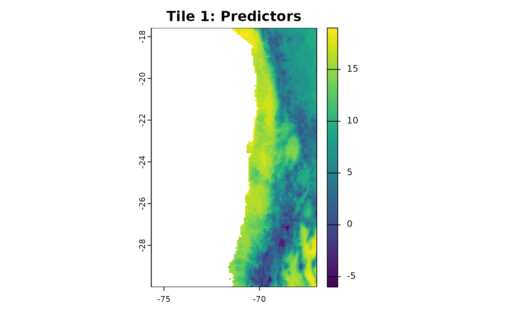
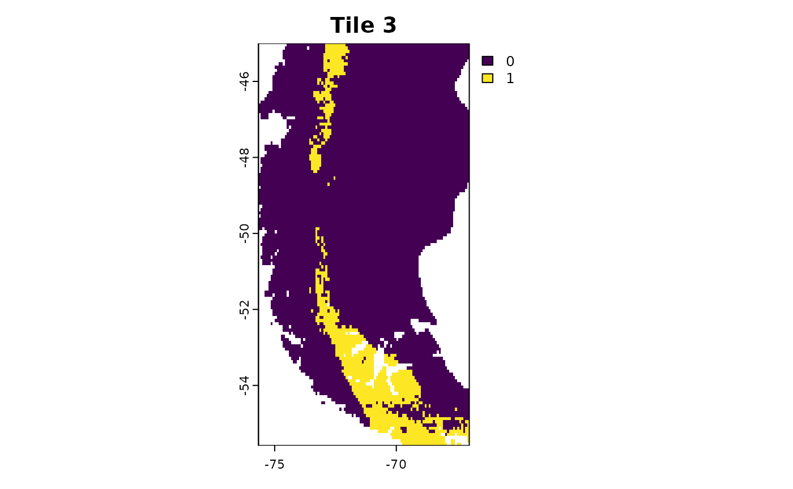

# 5. Improve computation time of CAST methods

Working with machine learning methods and spatial data can be
computationally expensive. Especially for larger scale applications like
[global maps (Ludwig et. al 2024)](https://doi.org/10.1111/geb.13635) or
high resolution data (e.g. from drones) computation times of CAST
methods can be quite long. This vignette goes over various options for
efficient spatial modelling workflows and parallelization options in
order to speed up computation times of CAST methods.

## Forward feature selection

As the forward feature selection basically is a brute force grid search
of the best predictor variable combination, during `ffs` a large number
of machine learning models are trained to compare their performance.
These model trainings can be run in parallel. On Unix machines, this is
implemented using `mclapply` from the `parallel-package`. Simply set the
`cores` argument to a value `> 1` to use multiple cores for the model
training. On windows machines, you will get the warning
`Parallel computations of ffs only implemented on unix systems. cores is set to 1`.

``` r
data("splotdata")
spatial_cv = CreateSpacetimeFolds(splotdata, spacevar = "Biome", k = 5)
ctrl <- trainControl(method="cv",index = spatial_cv$index)

ffsmodel <- ffs(predictors = splotdata[,6:16],
                response = splotdata$Species_richness,
                tuneLength = 1,
                method = "rf",
                trControl = ctrl,
                ntree = 20,
                seed = 1,
                cores = 4)
```

Regardless of the system, you can speed up the model training in `ffs`,
as [`caret::train`](https://rdrr.io/pkg/caret/man/train.html) has a
[parallelization
option](https://topepo.github.io/caret/parallel-processing.html) that
trains models on multiple cores. The code below is adapated from
[https://topepo.github.io/caret/parallel-processing](https://topepo.github.io/caret/parallel-processing.html)

``` r
library(doParallel)

data("splotdata")
spatial_cv = CreateSpacetimeFolds(splotdata, spacevar = "Biome", k = 4)
ctrl <- trainControl(method="cv",index = spatial_cv$index)

cl <- makeCluster(4)
registerDoParallel(cl)
ffsmodel <- ffs(predictors = splotdata[,6:16],
                response = splotdata$Species_richness,
                tuneLength = 4,
                method = "rf",
                trControl = ctrl,
                ntree = 20,
                seed = 1,
                cores = 1)
stopCluster(cl)
```

Another option is the use of a different model algorithm. For example,
the `ranger` package is a fast and multicore implementation of the
random forest model.

``` r
ffsmodel <- ffs(predictors = splotdata[,6:16],
                response = splotdata$Species_richness,
                method = "ranger")
```

## Area of applicability

Estimating the Area of Applicability (AOA) can be computationally
expansive as the method is based on finding minimum distances and
nearest neighbors. We can divide the computation into three major
chunks:

1.  The feature space distance between all training data.
2.  The nearest feature space distance between training data in
    different CV folds.
3.  The distance between new locations (pixel) and the nearest training
    data in feature space.

(1.) and (2.) are needed to derive the AOA threshold and solely based on
the training data and cross validation configuration. They are computed
together in the `trainDI` function. (3.) is needed to calculate the
dissimilarity index of the predictor stack in the `aoa` function. Under
the hood, the `aoa` function calls `trainDI` as it’s first step and then
calculates the DI of the predictor stack.

You can speed up computation times of `aoa` by splitting these two
processes and calculate the DI on multiple raster tiles at once.

### trainDI

``` r
library(CAST)
library(caret)
library(terra)
library(sf)

data("splotdata")
predictors <- rast(system.file("extdata","predictors_chile.tif",package="CAST"))
splotdata <- st_drop_geometry(splotdata)
```

``` r
set.seed(10)
model <- train(splotdata[,names(predictors)],
               splotdata$Species_richness,
               method="rf",
               tuneLength = 1,
               importance=TRUE,
               ntrees = 20,
               trControl = trainControl(method="cv"), number = 5)
prediction <- predict(predictors, model, na.rm=TRUE)
```

Calling `trainDI` just needs the model object, as this also contains the
training data, cross-validation information and variable importance. The
result of `trainDI` then contains all the necessary information from the
training data and model that the `aoa` function needs to compute the DI
for new locations.

``` r
tdi = trainDI(model, verbose = FALSE)
print(tdi)
```

    ## DI of 703 observation 
    ## Predictors: bio_1 bio_4 bio_5 bio_6 bio_8 bio_9 bio_12 bio_13 bio_14 bio_15 elev 
    ## 
    ## AOA Threshold: 0.1903705

``` r
class(tdi)
```

    ## [1] "trainDI"

``` r
str(tdi)
```

    ## List of 10
    ##  $ train             :'data.frame':  703 obs. of  11 variables:
    ##   ..$ bio_1 : num [1:703] 17.6 17.4 18.3 18 18.8 ...
    ##   ..$ bio_4 : num [1:703] 464 460 473 486 478 ...
    ##   ..$ bio_5 : num [1:703] 30.5 30.1 31.4 31.2 32 ...
    ##   ..$ bio_6 : num [1:703] 3.6 3.5 4.2 4.2 4.4 ...
    ##   ..$ bio_8 : num [1:703] 23.2 22.9 24 23.9 24.5 ...
    ##   ..$ bio_9 : num [1:703] 11.7 11.5 12.2 11.8 12.6 ...
    ##   ..$ bio_12: num [1:703] 760 731 810 842 853 842 823 525 524 554 ...
    ##   ..$ bio_13: num [1:703] 119 115 129 140 134 133 129 92 90 90 ...
    ##   ..$ bio_14: num [1:703] 9 9 12 13 12 12 12 7 6 5 ...
    ##   ..$ bio_15: num [1:703] 68.9 68.9 66.9 65.5 68.3 ...
    ##   ..$ elev  : num [1:703] 416 468 232 129 231 243 193 188 261 468 ...
    ##  $ weight            :'data.frame':  1 obs. of  11 variables:
    ##   ..$ bio_1 : num 20.4
    ##   ..$ bio_4 : num 20.3
    ##   ..$ bio_5 : num 14.6
    ##   ..$ bio_6 : num 22.6
    ##   ..$ bio_8 : num 18.5
    ##   ..$ bio_9 : num 15.1
    ##   ..$ bio_12: num 25.9
    ##   ..$ bio_13: num 17.3
    ##   ..$ bio_14: num 18.6
    ##   ..$ bio_15: num 18.2
    ##   ..$ elev  : num 14.3
    ##  $ variables         : chr [1:11] "bio_1" "bio_4" "bio_5" "bio_6" ...
    ##  $ catvars           : chr(0) 
    ##  $ scaleparam        :List of 4
    ##   ..$ dim          : int [1:2] 703 11
    ##   ..$ dimnames     :List of 2
    ##   .. ..$ : chr [1:703] "1" "2" "3" "4" ...
    ##   .. ..$ : chr [1:11] "bio_1" "bio_4" "bio_5" "bio_6" ...
    ##   ..$ scaled:center: Named num [1:11] 14.26 171.83 21.77 6.71 14.4 ...
    ##   .. ..- attr(*, "names")= chr [1:11] "bio_1" "bio_4" "bio_5" "bio_6" ...
    ##   ..$ scaled:scale : Named num [1:11] 7.27 156.2 8.2 6.67 8.28 ...
    ##   .. ..- attr(*, "names")= chr [1:11] "bio_1" "bio_4" "bio_5" "bio_6" ...
    ##  $ trainDist_avrg    : num [1:703] 87.2 87.2 87.1 86.9 87.6 ...
    ##  $ trainDist_avrgmean: num 81.5
    ##  $ trainDI           : num [1:703] 0.0222 0.0173 0.0258 0.0409 0.0115 ...
    ##  $ threshold         : Named num 0.19
    ##   ..- attr(*, "names")= chr "75%"
    ##  $ method            : chr "L2"
    ##  - attr(*, "class")= chr "trainDI"

``` r
# you can save the trainDI object for later application
saveRDS(tdi, "path/to/file")
```

### AOA for multiple rasters

If you have a very large area of interest for which you want to derive
the Area of Applicability, computing the AOA for the entire area at once
might not be possible or takes a very long time. You can use a tile
based approach to apply the `trainDI` object from the previous step to
multiple rasters at once.

``` r
r1 = crop(predictors, c(-75.66667, -67, -30, -17.58333))
r2 = crop(predictors, c(-75.66667, -67, -45, -30))
r3 = crop(predictors, c(-75.66667, -67, -55.58333, -45))


plot(r1[[1]],main = "Tile 1")
plot(r2[[1]],main = "Tile 2")
plot(r3[[1]],main = "Tile 3")
```


Use the `trainDI` argument in the `aoa` function to specify, that you
want to use a previously computed trainDI object.

``` r
aoa_r1 = aoa(newdata = r1, trainDI = tdi)

plot(r1[[1]], main = "Tile 1: Predictors")
plot(aoa_r1$DI, main = "Tile 1: DI")
plot(aoa_r1$AOA, main = "Tile 1: AOA")
```



You can now run the aoa function in parallel on the different tiles! Of
course you can use for favorite parallel backend for this task, here we
use mclapply from the `parallel` package.

``` r
library(parallel)

tiles_aoa = mclapply(list(r1, r2, r3), function(tile){
  aoa(newdata = tile, trainDI = tdi)
  
}, mc.cores = 3)
```

``` r
plot(tiles_aoa[[1]]$AOA, main = "Tile 1")
plot(tiles_aoa[[2]]$AOA, main = "Tile 2")
plot(tiles_aoa[[3]]$AOA, main = "Tile 3")
```



For even larger tasks it might be useful to save the tiles to you
hard-drive and load them one by one to avoid filling up your RAM.

``` r
# Simple Example Code for raster tiles on the hard drive

tiles = list.files("path/to/tiles", full.names = TRUE)

tiles_aoa = mclapply(tiles, function(tile){
  current = terra::rast(tile)
  aoa(newdata = current, trainDI = model_random_trainDI)
  
}, mc.cores = 3)
```
